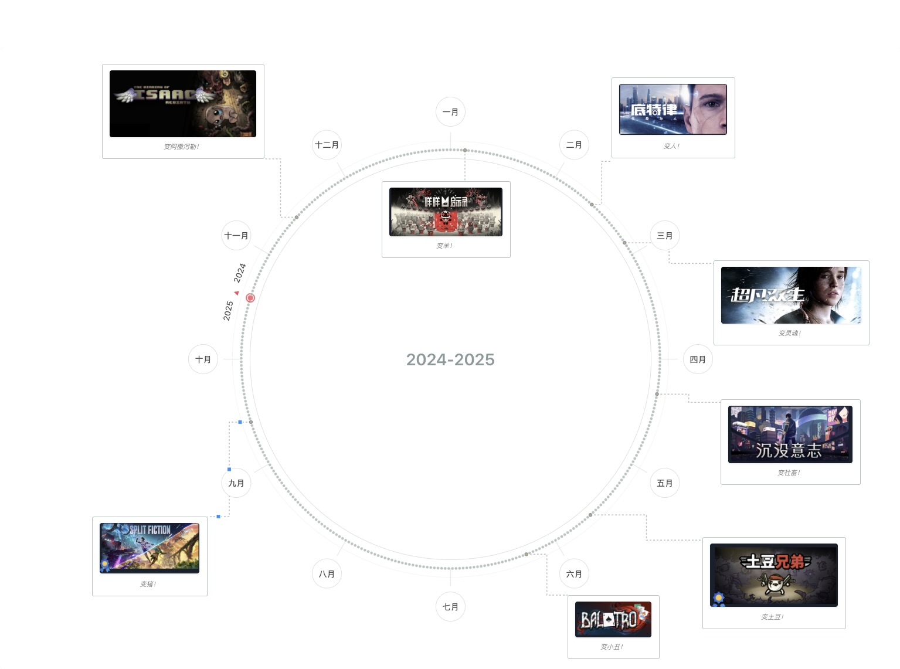

# 环形月份图画布

一个优雅的年度回顾可视化工具，通过环形月份图帮助用户记录和展示一年中的重要事件。

## 设计灵感

本项目的设计灵感来源于小红书上一位设计师Francine分享的美食时间轴创意。该创意通过环形时间轴记录一年中与爱人共同品尝的美食，用"爱是在一起吃好多好多顿饭"的温暖理念，将时间可视化为充满回忆的圆环。这个项目将这一创意扩展为通用的年度记录工具，让每个人都能创建属于自己的时间纪念册。


## 项目简介

环形月份图画布是一个基于Web的可视化工具，专为个人年度回顾和记录设计。用户可以在美观的环形月份图上添加文字和图片记录，创建独特的年度纪念册。



## 核心特色

- **环形时间轴设计**：12个月份沿圆周均匀分布，直观展示时间流程
- **自定义年度周期**：支持设定任意起始日期，如学年、财年、纪念日周期等
- **灵活的记录方式**：支持文字记录和图片记录，图片可添加描述文字
- **个性化边框颜色**：5种莫兰迪色系边框，区分不同类型事件
- **自由布局调整**：拖拽、缩放记录卡片，优化视觉效果
- **高质量导出**：支持高清PNG图片导出，适合打印和分享
- **本地存储**：支持浏览器本地存储和文件导入导出

## 技术栈

- **前端框架**：原生JavaScript (ES6+)
- **样式设计**：CSS3 + 莫兰迪色系设计
- **图形渲染**：SVG + Canvas
- **交互库**：Interact.js (拖拽和缩放)
- **导出功能**：html2canvas (高清图片导出)
- **存储方案**：LocalStorage + File System Access API

## 功能特性

### 画布与背景系统

- **环形月份图背景**：12个月份沿圆周均匀分布，包含对应日期小点
- **年份选择功能**：支持1900-2100年范围，自动处理闰年
- **起始日期设定**：自定义年度周期起点，支持跨年记录（如2024.10.19-2025.10.19）
- **特殊标记系统**：起点终点位置标记，圆心方向箭头指示时间流向

### 内容创作系统

- **文字记录功能**：支持多行文本输入，无字数限制
- **图片插入功能**：支持本地文件上传和拖拽上传，自动压缩优化
- **图片描述功能**：为图片添加描述文字，组合显示
- **边框颜色自定义**：5种预设颜色方案（经典、温暖、清新、优雅、柔和）

### 记录管理系统

- **基础默认位置**：提供网格式的默认位置分配，用户可手动调整避免重叠
- **圈内外分布**：记录可放置在环形图内部或外部区域
- **自由拖拽调整**：支持记录卡片的自由拖拽和位置调整
- **多方向缩放**：支持东南、东、南三个方向的尺寸调整
- **右键菜单操作**：简洁的编辑和删除操作，优化打印效果

### 连接线系统

- **自动连接线**：记录与对应日期之间自动绘制连接线
- **智能路径规划**：连接线避开其他元素，保持视觉清晰
- **动态更新**：拖拽记录时连接线实时更新
- **连接线调整功能**：
  - **可视化控制手柄**：选中记录时显示连接线控制手柄，支持直观的拖拽调整
  - **智能线段调整**：横向线段支持上下调整，纵向线段支持左右调整
  - **保持横平竖直**：调整过程中自动保持连接线的横平竖直特性
  - **实时预览**：拖拽过程中实时显示调整效果
  - **状态持久化**：连接线调整状态自动保存，刷新页面后保持调整结果
  - **重置功能**：支持将连接线重置回默认位置

### 数据管理系统

- **自动保存**：实时保存用户数据到浏览器本地存储
- **数据导入导出**：支持JSON格式的数据备份和恢复
- **本地文件存储**：支持File System Access API，解决浏览器存储限制
- **高清图片导出**：支持PNG格式高清图片导出，适合打印

### 交互体验

- **键盘快捷键**：Ctrl+Enter快速保存，ESC关闭弹窗等
- **用户反馈系统**：操作状态提示和错误信息显示
- **浏览器兼容性检查**：自动检测并提示兼容性问题
- **响应式设计**：适配不同屏幕尺寸

## 快速开始

### 环境要求

- **现代浏览器**：Chrome 90+、Firefox 88+、Safari 14+、Edge 90+
- **本地Web服务器**：用于文件访问和完整功能体验
- **屏幕分辨率**：建议1920×1080或更高

### 安装运行

1. **克隆或下载项目**
   ```bash
   git clone <repository-url>
   cd yearcircle
   ```

2. **启动本地服务器**
   ```bash
   # 使用Python（推荐）
   python3 -m http.server 8001
   
   # 或使用Node.js
   npx serve .
   
   # 或使用PHP
   php -S localhost:8001
   ```

3. **访问应用**
   打开浏览器访问 `http://localhost:8001`

### 基本使用流程

1. **选择年份**：在顶部工具栏选择要记录的年份（1900-2100）
2. **设置起始日期**：可选择自定义年度周期的起始日期（如学年、财年）
3. **添加记录**：点击环形图上的日期小点，选择添加文字或图片记录
4. **个性化设置**：为记录选择边框颜色，区分不同类型事件
5. **调整布局**：拖拽记录卡片调整位置，拖拽边缘调整大小
6. **保存导出**：使用工具栏的导出功能保存为高清PNG图片

## 详细使用指南

### 画布操作

**年份选择**
- 支持输入框直接输入年份
- 使用左右箭头按钮切换年份
- 自动处理闰年，2月显示正确天数

**自定义年度周期**
- 点击"自定义"按钮设置起始日期
- 支持任意日期作为年度起点（如2024年10月19日）
- 环形图显示起点和终点标记
- 圆心显示年份范围（如"2024-2025"）

### 记录创建

**文字记录**
- 点击日期小点选择"添加文字记录"
- 支持多行文本输入，无字数限制
- 使用Ctrl+Enter快速保存
- 可选择5种边框颜色方案

**图片记录**
- 点击日期小点选择"添加图片记录"
- 支持拖拽上传或点击选择文件
- 可为图片添加描述文字
- 自动压缩优化，支持10MB以内文件

### 记录管理

**位置调整**
- 拖拽记录卡片到任意位置
- 支持圈内外区域放置
- 自动绘制连接线到对应日期

**尺寸调整**
- 东南角手柄：同时调整宽度和高度
- 东边手柄：仅调整宽度
- 南边手柄：仅调整高度

**编辑操作**
- 右键点击记录显示上下文菜单
- 选择"编辑"修改内容
- 选择"删除"移除记录

**连接线调整**
- 点击选中记录后，连接线上会显示控制手柄
- 拖拽控制手柄调整连接线路径：
  - 横向线段：上下拖拽调整垂直位置
  - 纵向线段：左右拖拽调整水平位置
- 调整过程中连接线保持横平竖直特性
- 调整完成后自动保存，刷新页面后保持调整结果

## 技术架构

### 核心技术栈

- **前端框架**：原生JavaScript (ES6+)，无依赖框架
- **样式设计**：CSS3 + 莫兰迪色系设计语言
- **图形渲染**：SVG（环形图）+ Canvas（导出）
- **交互库**：Interact.js v1.10+（拖拽和缩放）
- **导出功能**：html2canvas v1.4+（高清图片导出）
- **存储方案**：LocalStorage + File System Access API

### 项目结构

```
yearcircle/
├── index.html                    # 主页面入口
├── scripts/                      # JavaScript模块
│   ├── main.js                  # 主应用逻辑和初始化
│   ├── circle-renderer.js       # 环形图渲染引擎
│   ├── record-manager.js        # 记录管理和CRUD操作
│   ├── interaction-handler.js   # 用户交互处理
│   ├── export-manager.js        # 数据导出和图片生成
│   ├── file-storage.js          # 文件系统存储管理
│   ├── storage.js               # 本地存储管理
│   └── utils.js                 # 工具函数和辅助方法
├── styles/                       # 样式文件
│   ├── main.css                 # 主样式和布局
│   └── components.css           # 组件样式和交互效果
└── README.md                     # 项目说明文档
```

### 核心算法

**环形布局算法**
- 基于极坐标系统计算月份和日期位置
- 支持自定义起始角度和年度周期
- 动态计算闰年和月份天数

**位置约束系统**
- 边界约束确保记录不超出画布
- 圈内外区域判断和手动调整
- 连接线路径优化算法

**数据持久化**
- 实时自动保存机制
- JSON格式数据序列化
- 版本兼容性处理

## 数据格式

### 导出数据结构

应用使用JSON格式存储和导出数据，结构如下：

```json
{
  "year": 2024,
  "startDate": "2024-10-19",
  "canvasSize": {
    "width": 1535,
    "height": 1063
  },
  "records": [
    {
      "id": "record_20241219_001",
      "date": "2024-03-15",
      "type": "text",
      "content": "今天完成了重要的项目里程碑",
      "position": {"x": 650, "y": 300},
      "size": {"width": 200, "height": 120},
      "borderColor": "classic",
      "connectionLine": {
        "pathPoints": [
          {"x": 750, "y": 360},
          {"x": 850, "y": 360},
          {"x": 850, "y": 450},
          {"x": 920, "y": 450}
        ]
      },
      "createdAt": "2024-03-15T10:30:00Z"
    },
    {
      "id": "record_20241219_002", 
      "date": "2024-06-20",
      "type": "image",
      "content": "data:image/jpeg;base64,/9j/4AAQ...",
      "imageDescription": "毕业典礼合影",
      "position": {"x": 400, "y": 500},
      "size": {"width": 180, "height": 150},
      "borderColor": "warm",
      "createdAt": "2024-06-20T15:45:00Z"
    }
  ],
  "metadata": {
    "version": "1.4",
    "totalRecords": 2,
    "lastModified": "2024-12-19T10:30:00Z",
    "appVersion": "环形月份图画布 V1.4"
  }
}
```

### 字段说明

| 字段 | 类型 | 说明 |
|------|------|------|
| `year` | Number | 记录年份 |
| `startDate` | String | 年度周期起始日期（ISO格式） |
| `canvasSize` | Object | 画布尺寸（宽度×高度） |
| `records` | Array | 记录数组 |
| `records[].id` | String | 记录唯一标识符 |
| `records[].date` | String | 记录日期（ISO格式） |
| `records[].type` | String | 记录类型（text/image） |
| `records[].content` | String | 记录内容（文字或Base64图片） |
| `records[].imageDescription` | String | 图片描述（可选） |
| `records[].position` | Object | 记录位置坐标 |
| `records[].size` | Object | 记录卡片尺寸 |
| `records[].borderColor` | String | 边框颜色方案 |
| `records[].connectionLine` | Object | 连接线调整数据（可选，V1.5新增） |
| `records[].connectionLine.pathPoints` | Array | 连接线路径点坐标数组 |
| `records[].createdAt` | String | 创建时间（ISO格式） |

## 浏览器兼容性

| 浏览器 | 最低版本 | 功能支持 | 备注 |
|--------|----------|----------|------|
| **Chrome** | 90+ | 🟢 完全支持 | 推荐使用，性能最佳 |
| **Firefox** | 88+ | 🟢 完全支持 | 良好兼容性 |
| **Safari** | 14+ | 🟡 基本支持 | 部分新特性可能受限 |
| **Edge** | 90+ | 🟢 完全支持 | 基于Chromium，兼容性好 |

### 功能兼容性说明

- **File System Access API**：Chrome 86+、Edge 86+支持，其他浏览器使用传统下载方式
- **拖拽上传**：所有现代浏览器支持
- **高清导出**：依赖html2canvas，所有支持的浏览器均可使用
- **本地存储**：所有现代浏览器支持LocalStorage

## 常见问题

### 🔧 技术问题

**Q: 为什么图片无法上传？**
A: 请确保：
1. 使用本地Web服务器访问应用（不要直接打开HTML文件）
2. 图片文件大小不超过10MB
3. 图片格式为常见格式（JPG、PNG、GIF、WebP等）

**Q: 数据会丢失吗？**
A: 
1. 应用使用浏览器本地存储，数据保存在您的设备上
2. 建议定期使用"导出数据"功能备份JSON文件
3. 清除浏览器数据会导致记录丢失

### 📱 使用问题

**Q: 如何创建跨年的年度周期？**
A:
1. 点击工具栏的"自定义"按钮
2. 选择起始日期（如2024年10月19日）
3. 系统自动计算终点日期（2025年10月18日）
4. 环形图会显示跨年的月份排列

**Q: 记录卡片重叠了怎么办？**
A:
1. 拖拽记录卡片到合适位置
2. 使用缩放手柄调整卡片大小
3. 利用圈内外区域合理分布记录

**Q: 如何批量管理记录？**
A:
1. 使用"导出数据"功能备份所有记录
2. 使用"清空记录"功能重新开始
3. 使用"导入数据"功能恢复备份

### 💡 使用技巧

**提高效率的建议：**
1. 使用键盘快捷键提高操作效率
2. 为不同类型事件选择不同边框颜色
3. 合理利用圈内外空间分布记录
4. 定期导出备份，避免数据丢失
5. 使用描述性文字，便于后续查找

**最佳实践：**
1. 建议按时间顺序添加记录
2. 图片记录添加简短描述文字
3. 重要事件使用显眼的边框颜色
4. 定期整理和调整记录布局
5. 年末导出高清图片作为纪念


### 贡献指南

1. Fork项目仓库
2. 创建功能分支
3. 提交更改
4. 发起Pull Request

### 许可证

本项目采用MIT许可证，详见LICENSE文件。

---

**环形月份图画布** - 让时间可视化，让回忆永恒化